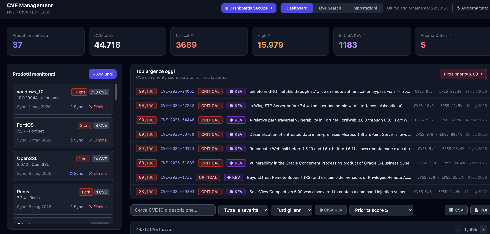
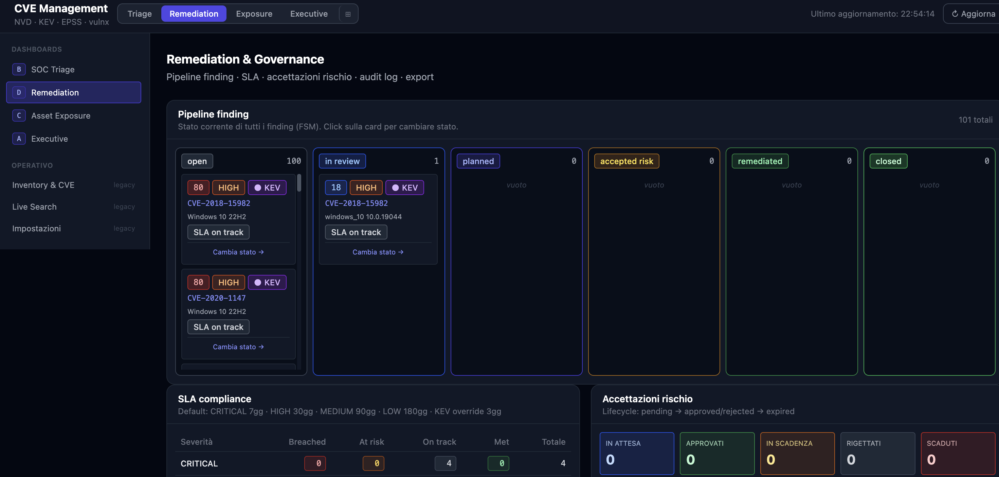
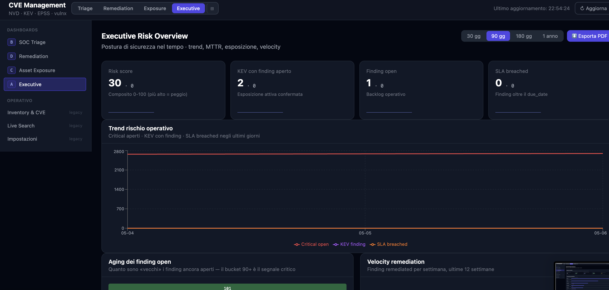

# CVE Management Platform

> Vulnerability-management platform che ingerisce CVE da fonti autorevoli, le correla con un inventario software interno e produce **finding prioritizzati** con tracking del ciclo di remediation.



[]()
[]()
[]()
[]()
[](https://github.com/Johnny9802/cve_management/actions/workflows/ci.yml)

> ⚠️ **Disclaimer** — progetto personale di laboratorio, non production-ready. Manca auth/RBAC, è single-tenant single-instance, non è stato penetration-tested. Codice scritto come portfolio per esplorare patterns moderni di backend asincrono, vulnerability intelligence e OpSec applicato a integrazioni esterne.

---

## Cosa fa, in una riga

Carica l'inventario software (CSV/API), lo normalizza in CPE, scarica le CVE rilevanti dai feed pubblici, le arricchisce con EPSS+KEV+exploitability, calcola un **priority score 0–100** e produce finding tracciabili attraverso una FSM (`open → in_review → planned → remediated | accepted_risk | closed`).

## Perché esiste

Risponde a tre domande tipiche del vulnerability management:

| Problema reale | Risposta della piattaforma |
|---|---|
| I feed CVE sono enormi e rumorosi | Mirror locale con delta-sync incrementale (VulnCheck NVD++ / NIST NVD) |
| Mappare *versione installata → CVE* è ambiguo | Resolution layer: CPE normalizer (rapidfuzz) + version matcher (semver, OpenSSL patch letters, pre-release) con confidence `CERTAIN`/`UNCERTAIN` |
| Mille CVE — quale risolvo *prima*? | Priority score che combina EPSS (40) + CVSS (25) + KEV (25) + recency (10) + exploitability (8) → 0–100 |

---

## Highlights tecnici (perché questo repo è interessante)

### 1. Architettura a 4 layer disaccoppiati

```
┌─────────────────────────────────────────────────────────────────────────┐
│  L1 ─ DATA          PostgreSQL 16 · JSONB GIN-indexed · history tables │
├─────────────────────────────────────────────────────────────────────────┤
│  L2 ─ INGESTION     VulnCheck → NVD → EPSS → KEV → vulnx               │
│                     TokenBucket per provider · CircuitBreaker FSM      │
│                     APScheduler: delta 1h · epss 24h · kev 6h          │
├─────────────────────────────────────────────────────────────────────────┤
│  L3 ─ RESOLUTION    CpeNormalizer (rapidfuzz) · VersionMatcher · cache │
├─────────────────────────────────────────────────────────────────────────┤
│  L4 ─ QUERY         Tier 1 local DB → Tier 2 CIRCL → Tier 3 OpenCVE    │
│                     Tier 4 vulnx on-demand · OpSec gate per provider   │
└─────────────────────────────────────────────────────────────────────────┘
```

ADR completi e diagrammi C4 nel piano di architettura.

### 2. Priority engine post-CVSS

Pesare EPSS al 40% e KEV al 25% (anziché un CVSS dominante) riflette la dottrina post-2022 di FIRST/SSVC: la *severity tecnica* conta meno della *probabilità che qualcuno stia davvero sfruttando la CVE*.

```python
score = round(EPSS × 40)               # 0–40   probabilità ML di sfruttamento
      + CVSS_band                       # 0–25   severity tecnica (CRITICAL=25, HIGH=18, MEDIUM=10, LOW=4)
      + (25 if is_kev else 0)           # 0/25   exploit attivo confermato (CISA)
      + recency_bonus                   # 0–10   ≤30g→10, ≤90g→6, ≤365g→3
      + exploitability_bonus            # 0–8    Nuclei template→8, public PoC→5
                                        # cap 100
```

Etichette: ≥80 `CRITICAL`, ≥60 `HIGH`, ≥40 `MEDIUM`, <40 `MONITOR`. Implementazione: [`app/models/priority.py`](backend-py/app/models/priority.py).

### 3. OpSec-aware: l'inventario non lascia il perimetro

Vincolo di prodotto esplicito, applicato dal codice — non dalla policy:

| Provider | Tier | Cosa esce davvero |
|---|---|---|
| VulnCheck NVD++ / NIST NVD | Ingest | nessun dato cliente — solo `lastModified` |
| FIRST EPSS · CISA KEV | Enrich | solo `cve_id`, mai dati interni |
| CIRCL (fallback) | T2 | `vendor` + `product` espliciti, mai `hostname`/`ip`/`asset_id` |
| OpenCVE (background) | T3 | `vendor`/`product` subscription |
| vulnx (exploitability) | T4 | solo `cve_id` |

L'enforcement è nel codice: [`OpsecAwareClient`](backend-py/app/core/http.py) ispeziona ogni request in uscita e *blocca* (con `OpsecViolationError`) qualsiasi payload che contenga IPv4, MAC, o field name come `hostname`/`asset_id`. Coperto da test: [`tests/security/test_opsec_egress.py`](backend-py/tests/security/test_opsec_egress.py).

### 4. Resilienza alle API esterne

- **Token bucket per provider** (`asyncio.Semaphore` configurabile) — evita di farsi bannare da NVD/VulnCheck
- **Circuit breaker per provider** — FSM `CLOSED → OPEN → HALF_OPEN`, stato visibile su `/api/health`
- **Coda DB-backed** — tabella `sync_jobs` con `FOR UPDATE SKIP LOCKED`, polled ogni 5s da APScheduler. Niente Redis come queue, niente race conditions.
- **Multi-tier query con degraded mode** — se vulnx è OPEN, `/api/cves/{id}/intel` ritorna comunque i dati locali con `_meta.degraded=true`

### 5. Test pyramid completo

```
tests/
├── unit/          # 11 file — pure functions: version matcher, priority engine, CPE normalizer, token bucket, SLA, audit masking
├── contract/       # 6 file — respx HTTP mocks per ogni provider esterno (NVD, VulnCheck, EPSS, KEV, CIRCL, vulnx)
├── integration/    # 6 file — testcontainers (PostgreSQL+Redis): sync queue, FSM finding, e2e smoke, migrations
└── security/       # 2 file — OpSec egress + webhook SSRF prevention
```

≈3.600 LOC di test, isolati e ripetibili. Linting `ruff`, type-check `mypy` (strict mode aspirazionale: il config è strict, le violazioni residue sono in remediation).

---

## Demo scenario

Flusso end-to-end di un giro completo, dall'inventario al report:

1. **Import inventory** — l'utente carica il proprio inventario software (nome prodotto, vendor, versione) via CSV o `POST /api/products` (singolo o `bulk` fino a 500 record).
2. **Resolution** — il `CpeNormalizer` (rapidfuzz su catalog NVD CPE) traduce ogni `vendor/product/version` in un identificatore CPE-like, marcandolo `CERTAIN` o `UNCERTAIN`.
3. **Local correlation** — il `query_engine` interroga il mirror locale (tabella `cves`) e produce candidate finding via `VersionMatcher` (semver, OpenSSL patch letter, pre-release).
4. **Enrichment** — ogni CVE viene arricchita con EPSS (FIRST.org), KEV (CISA) e flag exploitability (`has_public_poc`, `has_nuclei_template`) provenienti da vulnx.
5. **Priority** — `compute_priority_score` produce uno score 0–100 con factor breakdown (EPSS, CVSS, KEV, recency, exploitability) consultabile su `/api/cves/{id}/intel`.
6. **Lifecycle** — i finding entrano in una FSM `open → in_review → planned → remediated | accepted_risk | closed`. Ogni transizione viene loggata in `findings_history` (chi, quando, perché).
7. **Reporting** — le 4 dashboard SecOps + l'export PDF Executive + l'export CSV/audit log danno alle personas (analyst / lead / asset owner / CISO) la vista filtrata sui propri obiettivi.

Tutti i sette step sono coperti da test integration/contract: vedi [`tests/integration/test_e2e_smoke.py`](backend-py/tests/integration/test_e2e_smoke.py) per il flusso completo e i provider mock in `tests/contract/`.

---

## Stack

**Backend** Python 3.12 · FastAPI · asyncpg · Pydantic v2 · structlog · Alembic · APScheduler · rapidfuzz · httpx
**Storage** PostgreSQL 16 (JSONB + GIN) · Valkey (Redis-compatible)
**Frontend** Next.js 14 (App Router) · React 18 · Tailwind · Recharts · jsPDF
**Tooling** uv (package manager) · ruff · mypy strict · pytest-asyncio · respx · testcontainers
**Container** Docker Compose (4 service: postgres, valkey, backend, frontend) · multi-stage Dockerfile

---

## Frontend — 4 dashboard SecOps + 1 hub

Oltre alla dashboard generale, il frontend espone 4 viste pensate per personas SOC distinti (cartelle `frontend/src/app/dashboards/`):

| Persona | Dashboard | Componenti chiave |
|---|---|---|
| SOC analyst | **Triage** | Live exploitability, urgent CVE panel, priority filtering |
| Remediation lead | **Remediation & Governance** | Findings pipeline, owner workload, SLA matrix, audit timeline, risk-acceptance lifecycle |
| Asset owner | **Asset Exposure** | Inventory coverage, top vendors/products, EOL flags, product heatmap |
| CISO / Manager | **Executive** | KPI trend, aging buckets, PDF export |

<table>
  <tr>
    <td width="50%"><p align="center"><sub><b>SOC Triage</b> — top urgenze, nuova exploitability, KEV invecchianti, EPSS in salita</sub></p></td>
    <td width="50%"><p align="center"><sub><b>Remediation & Governance</b> — pipeline FSM, SLA compliance, accettazioni rischio, audit log</sub></p></td>
  </tr>
  <tr>
    <td width="50%"><p align="center"><sub><b>Asset Exposure</b> — copertura inventario, top vendor per esposizione, EOL flags</sub></p></td>
    <td width="50%"><p align="center"><sub><b>Executive</b> — risk score, KEV con finding aperti, SLA breached, trend & velocity remediation</sub></p></td>
  </tr>
</table>

---

## Quick start

### Full stack (Docker Compose)

```bash
cp .env.example .env
# minimo: POSTGRES_PASSWORD, REDIS_PASSWORD, VULNCHECK_API_KEY (free tier su vulncheck.com)

docker compose up --build
```

> 💡 Le migration Alembic vengono applicate automaticamente al primo avvio (`AUTO_MIGRATE=true`, default). Per disabilitarle e farle a mano, setta `AUTO_MIGRATE=false` in `.env`.

- Frontend → http://localhost:3000
- API + Swagger → http://localhost:3001/api/docs
- Health → http://localhost:3001/api/health

### Dev locale (backend hot-reload, infra in Docker)

```bash
cd backend-py
uv venv --python 3.12 && uv sync --extra dev

cd .. && docker compose up postgres valkey -d
cd backend-py
DATABASE_URL=postgresql://cve_user:<pass>@localhost:5433/cve_management uv run alembic upgrade head
uv run uvicorn app.main:app --reload --port 8000
```

### Test

```bash
cd backend-py
uv run pytest tests/unit/ tests/contract/ -v   # no Docker
uv run pytest tests/integration/ -v -s         # testcontainers (richiede Docker)
uv run pytest --cov=app --cov-report=term-missing
```

Variabili principali: `DATABASE_URL`, `REDIS_URL`, `VULNCHECK_API_KEY` (richiesta), `NVD_API_KEY` (opzionale, alza rate limit a 50 req/30s), `OPENCVE_API_KEY`, `VULNX_API_KEY`, `OPSEC_ENFORCEMENT=true`. Lista completa in [`.env.example`](.env.example).

---

## Modello dati (essenziale)

```
products (inventory)            cves (mirror)              findings (M:N)
┌───────────────────┐           ┌───────────────────┐     ┌────────────────────┐
│ id, name, vendor, │           │ cve_id (PK),      │     │ product_id, cve_id │
│ version,          │  ───┐     │ raw_payload JSONB,│     │ status (FSM),      │
│ normalized_cpe,   │     │     │ cvss, epss_score, │     │ match_confidence,  │
│ cpe_confidence,   │     ├──── │ is_kev, kev_date, │ ────│ priority_score,    │
│ cve_count         │     │     │ has_public_poc,   │     │ assigned_to,       │
└───────────────────┘     │     │ has_template      │     │ due_date           │
                          │     └───────────────────┘     └────────────────────┘
   cpe_resolutions ◄──────┘                                       │
   (rapidfuzz cache)                                              ▼
                                                          findings_history
                                                          (audit trail FSM)

   sync_jobs (DB-backed queue, FOR UPDATE SKIP LOCKED)
   sync_state (last_success_at per source)
   epss_history (serie storica score)
   risk_acceptance, audit_log, exec_snapshots (governance)
```

8 migrations Alembic: [`backend-py/alembic/versions/`](backend-py/alembic/versions/).

---

## API — endpoint principali

Documentazione interattiva: `/api/docs`. Tutti prefissati `/api`.

| Area | Endpoint chiave |
|---|---|
| Inventory | `GET/POST /products`, `POST /products/bulk`, `POST /products/{id}/sync` |
| CVE | `GET /cves` (severity, kev, min_epss, min_priority, year), `GET /cves/{id}/intel` (aggregato vulnx + degraded mode), `GET /cves/export` (CSV BOM) |
| Findings | `GET /findings`, `PATCH /findings/{product_id}/{cve_id}` (FSM + history) |
| Live (real-time) | `GET /live` (NVD), `GET /circl`, `GET /cpe-suggest` |
| Dashboard | `GET /dashboard`, `GET /dashboard/timeline` |
| Governance | `risk-acceptance`, `sla`, `audit`, `webhooks` |
| Health | `GET /health` (circuit breakers + sync_state + scheduler), `GET /health/metrics` (latency p50/p95/p99) |

---

## Layout repository

```
cve-management/
├── backend-py/              # backend Python
│   ├── app/
│   │   ├── api/routers/     # 15 router FastAPI
│   │   ├── core/            # config, db pool, cache, logging, metrics, http (OpsecAwareClient), ssrf
│   │   ├── ingestion/       # client esterni + rate_governor + circuit_breaker + enrichment
│   │   ├── models/          # Pydantic v2 (nvd, product, finding, priority, intel)
│   │   ├── query/           # query_engine multi-tier · CIRCL · OpenCVE · vulnx_enricher
│   │   ├── resolution/      # cpe_normalizer · version_matcher · resolution_cache
│   │   ├── services/        # sla, audit, webhooks
│   │   └── workers/         # scheduler, sync_job_worker, daily_snapshot, risk_acceptance_expirer
│   ├── alembic/versions/    # 8 migrations (core → sync infra → hardening → exploitability → webhooks → risk acceptance/audit → exec snapshots)
│   └── tests/{unit,contract,integration,security}
├── frontend/                # Next.js 14
│   └── src/{app,components,lib}
│       └── components/      # CVE, Dashboard, Triage, Remediation, Exposure, Executive, LiveSearch, Products, Settings, Shell
├── docker-compose.yml       # postgres + valkey + backend + frontend
├── .env.example
└── CLAUDE.md                # developer guide
```

---

## Cosa NON c'è (perché è un MVP, non production)

| Mancanza | Perché non bloccante per il lab | Cosa servirebbe per production |
|---|---|---|
| Auth / RBAC | l'app gira su localhost / network interna | OIDC (Keycloak/Auth0), RBAC con ruoli analyst/manager/admin |
| Multi-tenancy | single-tenant per design | row-level security, scope sui product/finding |
| HA / scaling orizzontale | rate governor è `asyncio.Semaphore` single-instance | governor distribuito (Redis-based), leader election scheduler |
| Image build + supply chain | il workflow attuale fa lint/type/test, ma non builda l'immagine | aggiungere build Docker + Trivy/Grype scan + SBOM (Syft) + signed image |
| Penetration test | non è stato fatto | review esterna, SAST/DAST, secret scanning |
| Frontend in TypeScript | JSX è sufficiente per un MVP | migrazione TS + test (Playwright/Vitest) |

---

## Decisioni di design (note dal rewrite)

> **Operational docs.** See `docs/OPERATIONS.md`, `docs/RUNBOOK.md`,
> `docs/ARCHITECTURE.md`, `docs/DEPLOY.md`, and `CHANGELOG.md` for the
> production posture, incident playbook, architecture overview, and
> deploy patterns.

Il backend è un **rewrite Python** di un primo MVP Node.js (la cartella `backend/` legacy è stata rimossa nel commit di hardening Sprint 1; resta nel `git log` per chi vuole confrontare). Il rewrite è stato un'opportunità per:

- portare la logica di **version matching** preservandone i casi-limite (OpenSSL `1.0.2k`, pre-release `-rc1`, range `versionStartIncluding ≤ v < versionEndExcluding`)
- introdurre `asyncpg` al posto del pool sync precedente (latency p95 sull'endpoint `/cves` ↓)
- formalizzare 13 anti-pattern del primo backend (callback hell ingestion, no rate limit, no circuit breaker, query engine che faceva sempre fallback esterno…) in ADR e fixarli nel design a 4 layer
- aggiungere il livello **OpSec** (egress filter `OpsecAwareClient`) che nel primo MVP non esisteva
- aggiungere un test layer `security/` con egress + SSRF prevention sui webhook

---

## Roadmap evolutiva

### Verso production (hardening)

- **Auth**: OIDC + RBAC (analyst / manager / admin / read-only auditor)
- **Multi-tenancy**: row-level security PostgreSQL, `tenant_id` scoping su product / finding / audit
- **Distributed rate governor + leader election**: spostare TokenBucket su Redis e coordinare lo scheduler per scaling orizzontale
- **Image build + supply chain**: build Docker in CI, SBOM (Syft), scan vulnerabilità (Trivy/Grype), signing (Cosign/Sigstore)

### Vulnerability intelligence

- **Tier 5 — AI explanation layer (local-first)**: Ollama + Llama 3.1 8B / Qwen 2.5 / Phi-4 per remediation advice, threat narrative e contestualizzazione finding. Cloud (Claude/GPT) opt-in solo per reasoning complesso, dietro lo stesso `OpsecAwareClient` egress gate degli altri provider. Il deterministico (EPSS / CVSS / KEV) resta sovrano sul priority score; l'LLM produce **spiegazioni**, non decisioni.
- **SBOM / VEX**: import CycloneDX e SPDX al posto del CSV; export VEX (CSAF 2.0) per dichiarare `not_affected` / `fixed` / `under_investigation` ai consumer
- **Scanner ingestion**: connettori per Trivy / Grype / Wazuh / Tenable / Qualys → riuso del resolution layer esistente, niente doppio matching
- **Asset criticality multipliers**: campi `business_impact` / `exposure` / `data_classification` per asset → moltiplicatori applicati al priority score (oggi è solo CVE-side)
- **Reachability analysis**: dato un SBOM + call-graph applicativo, distinguere "package vulnerabile installato" da "funzione vulnerabile *effettivamente raggiungibile*" (pattern Snyk/Endor)
- **Compliance mapping**: mappare finding a controlli NIS2 / DORA / ISO 27001 / NIST 800-53 per export audit

### Operations & integrations

- **OpenTelemetry**: tracing distribuito affiancato a structlog (oggi solo log strutturato)
- **Outbound ticketing**: webhook Jira / ServiceNow / Linear su trigger SLA breach, KEV, priority ≥ 80
- **Patch advisor**: integrazione OSV.dev + Debian DSA + RHEL Security Advisories per suggerire upgrade path concreti per OS / package
- **WebSocket dashboard updates** al posto del polling 30s
- **Mini-DSL Lucene-like** per filtri CVE (`severity:critical AND is_kev:true AND epss:>0.5`) → AST → SQL parametrizzato
- **Frontend → TypeScript** + Playwright e2e

---

## License & Credits

Progetto personale a scopo formativo / portfolio — uso, redistribuzione e impieghi commerciali sono soggetti alle condizioni nel file [`LICENSE`](LICENSE) (non è una licenza OSI: il codice è pubblicato per review/valutazione, non per uso in produzione). Le fonti dati sono pubbliche:

- [NIST NVD](https://nvd.nist.gov/)
- [VulnCheck NVD++](https://vulncheck.com/) (free community tier)
- [FIRST EPSS](https://www.first.org/epss/)
- [CISA KEV Catalog](https://www.cisa.gov/known-exploited-vulnerabilities-catalog)
- [CIRCL](https://www.circl.lu/)
- [OpenCVE](https://www.opencve.io/)
- [ProjectDiscovery vulnx](https://github.com/projectdiscovery/vulnx)

Modello di prioritizzazione ispirato a **SSVC** (CISA/CMU SEI) e alla guidance FIRST sui pesi EPSS post-2022.

---

*Sviluppo guidato da [Claude Code](https://claude.com/claude-code) — il design a 4 layer, gli ADR, e l'analisi degli anti-pattern del backend Node.js sono il risultato di sessioni di pair-programming con sub-agent specializzati (architect, security, db, devops).*
